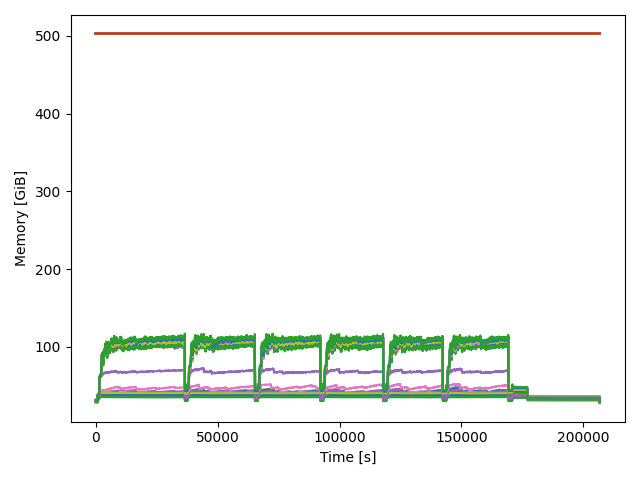
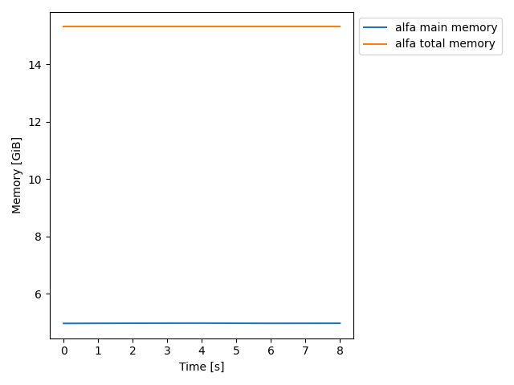

# MemoryTracing

A simple environment to trace and plot memory usage on a linux server cluster. 
The python script parses the output of the `free` linux command.

>For clusters using SLURM scheduling system, you can use `slurm.sh <jobId>` 
>for run the free command. If you don't have a parallel filesystem you need to
>gather all the files



## Requeriments
The **matplotlib** package is required to run this. **numpy** is also required. 
You can install with the requirements file or do it manually.

```bash
pip install -r requirements.txt
```

## Usage
The `run.sh` script contains an example. The steps required are:

1. Before running your app, launch the free command on the background. 
   Use `-s` option for enable the sampling and redirect the output into a file.
   **It's important to don't use the human-redable option (`-h, --human`)**.
2. Store the PID to kill it after you app finishes
3. Launch your application
4. Kill the `free` command with `kill $PID_FREE`
5. Launch `app/main.py -f $FREE_FILE -s $SAMPLING_TIME` to generate the plot.
   
There are several arguments for the plotting script (save name, units, 
plot percentatge), but the file and the sample time are mandatory args.

```bash
  -h, --help            
  --files FILES [FILES ...]
                        Input files, can use wildcard like *
  --samp SAMP           Sampling time
  --save SAVE           Enable and define save file name
  --swap                Enable swap plotting
  --total               Enable total memory available?
  --percentage          Plot perc of usage
  --legend              Plot legend
  --output_units OUTPUT_UNITS
                        Set output units for the plots
  --output_scale OUTPUT_SCALE
                        Factor that will be divide the memory results
  --file_pattern FILE_PATTERN
                        Set the file pattern for the input files
```
Next code block shows you an example of the units managment. The input file
is in KiB (default of free), so we need to divide by 1024*1024=1048576 to get
GiB in the plot
```bash
# Example :
./app/main.py --samp 2 --files test_inputs/alfa-mem.log --output_units GiB \
--output_scale 1048576
```
The output plot looks like this:


## Structure

Under the app folder, you can find:
 
* main.py: Entry point of the script
* arguments.py: Arguments for the script
* parsing.py: Parser for the input file
* definitions.py: Object definition for store the data
* plot.py: Plotting funtion

